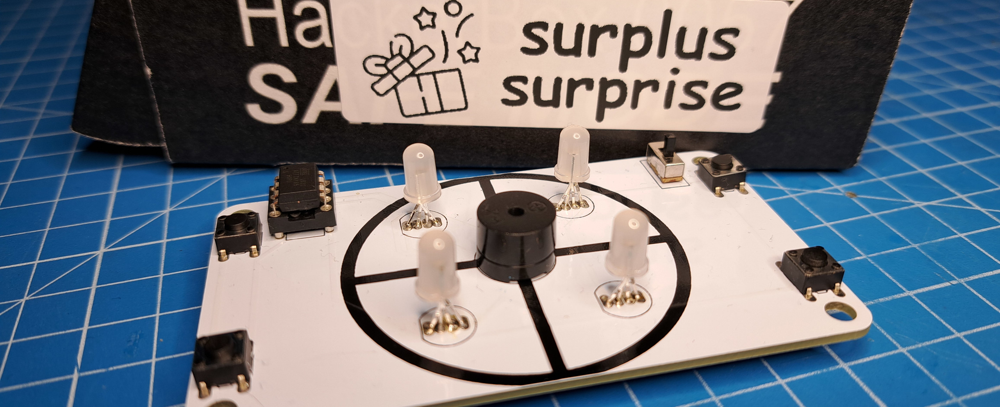
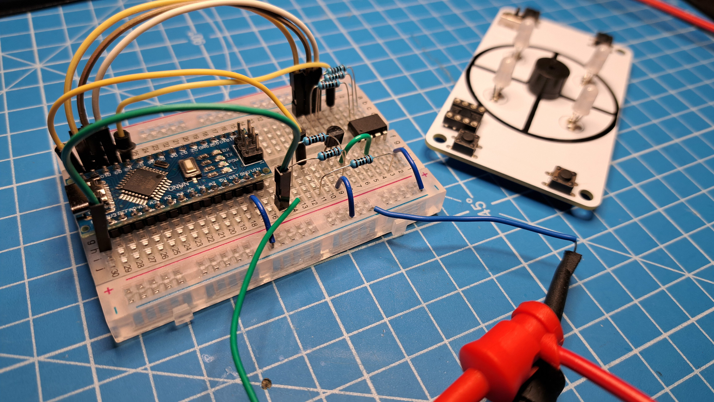

# HackerBoxes Simon Clone

I purchased a [Surpluse Surprise Box](https://hackerboxes.com/collections/subscriptions/products/surplus-surprise-box) from [HackerBoxes](https://hackerboxes.com/). Within that box was a PCB for what appeared to be a [Simon](https://en.wikipedia.org/wiki/Simon_(game)) clone. I decided to use this as an opportunity to exercise some basic PCB reverse engineering and software development skills. Without referring to any HackerBoxes documentation, I identified the components necessary to assemble the PCB and wrote this firmware for it. 

I had to handle a few hurdles along the way that made this a fairly interesting exercise:
* Having to disable the reset pin on the ATTiny85 in order to use it as GPIO to drive the buzzer. 
* Installing a bootloader onto the ATTiny85 in order to program it even with the reset pin disabled.
* Recovering a 'bricked' ATTiny85 by resetting its fuses to reenable the reset pin via high voltage serial programming.
* Having RGB LEDs with reversed power and ground pins.
* Having RGB LEDs with a chip that requires a few hundred microseconds for settings to latch before new commands can be sent.

I was eventually able to get it all working. This repository contains the code I wrote for this PCB as well as links to resources used to get it all working. 

I have since found that this PCB came from [HackerBoxes #0044](https://hackerboxes.com/products/hackerbox-0044-pcb-123). The [instructable for this box](https://www.instructables.com/HackerBox-0044-PCB-123/) includes a link to their own code for this PCB. 

# Operation
Power on the device with the power switch. It will go through a brief intro to let you know it's working. Then press one of the four button to select a difficulty level. The top-left is the lowest difficulty. Difficulty increases with the bottom-left, then bottom-right, then top-right for highest difficulty. Once the game is over it will wait for you to start a new game by selecting a difficulty level. 

# Programming Setup
There are no programming headers on the PCB. The ATTiny85 will need to be programmed before being installed into the PCB. I installed a [DIP-8 socket](https://www.ebay.com/sch/i.html?_nkw=DIP-8+socket&_sacat=0) onto the PCB to make removing the ATTiny85 for reprogramming quick and easy.

I used a [USBasp programmer](https://www.amazon.com/s?k=usbasp) and an [ATTiny85 break-out board](https://www.ebay.com/sch/i.html?_nkw=attiny85+dip-8+usb&_sacat=0) to initially program the [ATTiny85](https://ww1.microchip.com/downloads/en/devicedoc/atmel-2586-avr-8-bit-microcontroller-attiny25-attiny45-attiny85_datasheet.pdf) with the [Micronucleus bootloader](https://github.com/micronucleus/micronucleus). The USBasp may require some [extra setup to get it working](https://www.instructables.com/USBASP-Installation-in-Windows-10/). Once the bootloader was installed on the ATTiny85 I was able to use just the break-out board to program it. 

# Bootloader
To install [Micronucleus](https://github.com/micronucleus/micronucleus) from source I used [Windows Subsystem for Linux](https://learn.microsoft.com/en-us/windows/wsl/install) (WSL). This required an extra step of [attaching the USBasp programmer to the Linux environment](https://learn.microsoft.com/en-us/windows/wsl/connect-usb). 

I then installed [avrdude](https://github.com/avrdudes/avrdude) which will be used to perform the actual programming of the ATTiny85. 

I then cloned the Micronucleus project, compiled the firmware (`sudo make CONFIG=t85_default`), set the ATTiny85 fuses (`sudo make CONFIG=t85_default fuse`), programmed the firmware (`sudo make CONFIG=t85_default flash`), then disabled the reset pin (`sudo make CONFIG=t85_default disablereset`). 

With all this done, the ATTiny85 could now be programmed from the Arduino IDE using the Micronucleus bootloader.

# Arduino IDE
To program the ATTiny85 I am using the [ATTinyCore](https://github.com/SpenceKonde/ATTinyCore) which recommneds using Arduino IDE 1.8.13. This core also comes with a copy of [tinyNeoPixel](https://github.com/SpenceKonde/tinyNeoPixel) which I use to control the RGB LEDs. No other libraries are needed for this project.

Configure the board settings as follows:
|Setting|Value|
|---|---|
|Arduino Board|Configuration (with Bootloader)|
|Board|ATTiny85 (Micronucleus / DigiSpark)|
|Clock|16MHz|
|Timer1 Clock|CPU|
|LTO|enabled|
|millis()/micros()|enabled|
|Burn Bootloader Method|upgrade (via USB)|
|Reset Pin|GPIO|
|BOD Level|disabled|
|Programmer|micronucleus|

# Fuse Reset

I encountered a situation where I could no longer program the ATTiny85 via Micronucleus; something had become corrupted and the bootloader no longer functioned. In order to reprogram the ATTiny85 I would need to reset the fuses on it to enable the reset pin. This is possible on an ATTiny85 by using high voltage serial programming. 

Based on instructions from this [ATTiny Fuse Reset web page](https://sites.google.com/site/wayneholder/attiny-fuse-reset) I uploaded the reset fuse sketch to an Arduino Nano and then hooked it up to the ATTiny85 o0n a breadboard using the schematic provided on the site. I supplied 12V to the reset pin via a 1k resistor from my bench power supply. An NPN transistor is added to pull pin 1 to ground when needed by the fuse reset sketch. With this setup I was able to reset the fuses on the ATTiny85. I was then able to reinstall the bootloader and I was back in business.

The origins of the fuse reset sketch are a bit murky, but I believe the version I used originates from [this blog post by Paul Willoughby](https://www.rickety.us/2010/03/arduino-avr-high-voltage-serial-programmer/).
